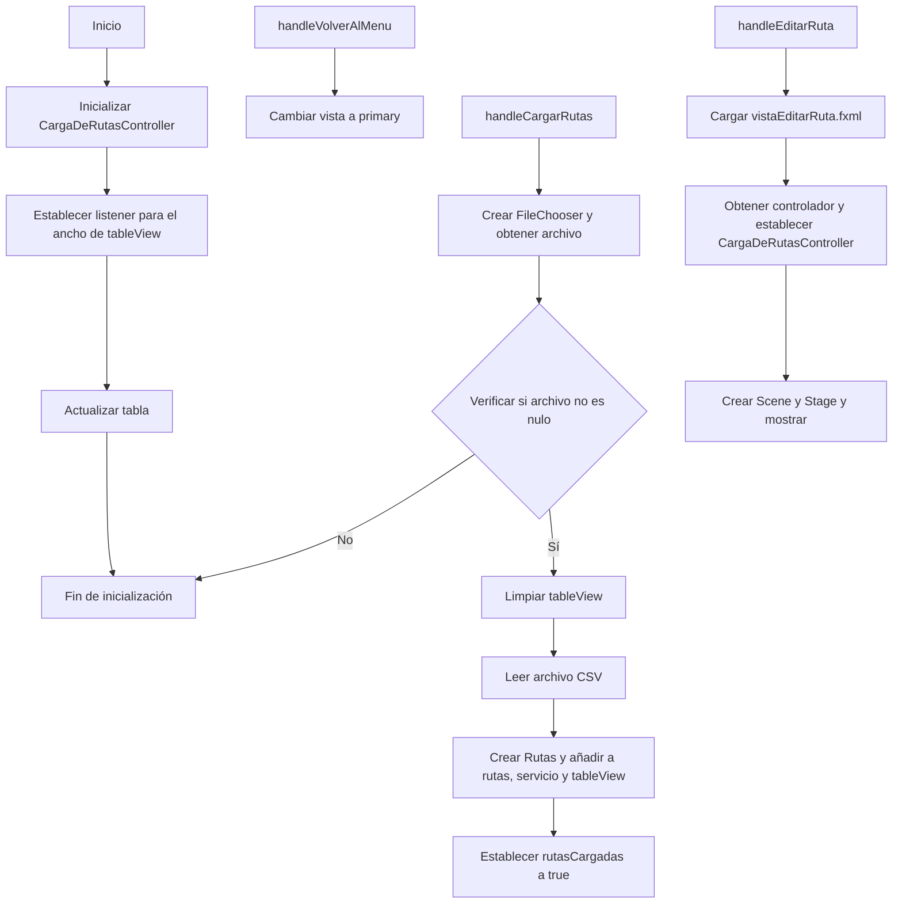

```mermaid
graph TD
    A[Inicio] --> B["Inicializar CargaDeRutasController"]
    B --> C["Establecer listener para el ancho de tableView"]
    C --> D["Actualizar tabla"]
    D --> E["Fin de inicialización"]
    F["handleVolverAlMenu"] --> G["Cambiar vista a primary"]
    H["handleCargarRutas"] --> I["Crear FileChooser y obtener archivo"]
    I --> J{Verificar si archivo no es nulo}
    J -->|Sí| K["Limpiar tableView"]
    K --> L["Leer archivo CSV"]
    L --> M["Crear Rutas y añadir a rutas, servicio y tableView"]
    M --> N["Establecer rutasCargadas a true"]
    J -->|No| E
    O["handleEditarRuta"] --> P["Cargar vistaEditarRuta.fxml"]
    P --> Q["Obtener controlador y establecer CargaDeRutasController"]
    Q --> R["Crear Scene y Stage y mostrar"]
```