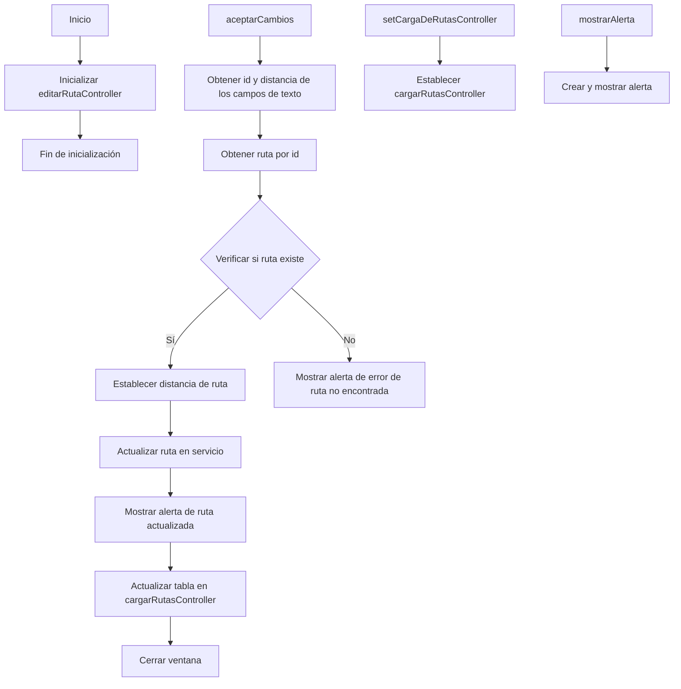

```mermaid
graph TD
    A[Inicio] --> B["Inicializar editarRutaController"]
    B --> C["Fin de inicialización"]
    D["aceptarCambios"] --> E["Obtener id y distancia de los campos de texto"]
    E --> F["Obtener ruta por id"]
    F --> G{Verificar si ruta existe}
    G -->|Sí| H["Establecer distancia de ruta"]
    H --> I["Actualizar ruta en servicio"]
    I --> J["Mostrar alerta de ruta actualizada"]
    J --> K["Actualizar tabla en cargarRutasController"]
    K --> L["Cerrar ventana"]
    G -->|No| M["Mostrar alerta de error de ruta no encontrada"]
    N["setCargaDeRutasController"] --> O["Establecer cargarRutasController"]
    P["mostrarAlerta"] --> Q["Crear y mostrar alerta"]


```