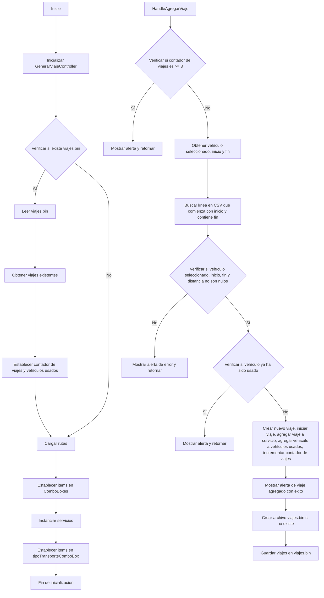

```mermaid
graph TD
    A[Inicio] --> B[Inicializar GenerarViajeController]
    B --> C{Verificar si existe viajes.bin}
    C -->|Sí| D[Leer viajes.bin]
    D --> E[Obtener viajes existentes]
    E --> F[Establecer contador de viajes y vehículos usados]
    F --> G[Cargar rutas]
    G --> H[Establecer items en ComboBoxes]
    H --> I[Instanciar servicios]
    I --> J[Establecer items en tipoTransporteComboBox]
    J --> L[Fin de inicialización]
    C -->|No| G
    K[HandleAgregarViaje] --> M{Verificar si contador de viajes es >= 3}
    M -->|Sí| N[Mostrar alerta y retornar]
    M -->|No| O[Obtener vehículo seleccionado, inicio y fin]
    O --> P[Buscar línea en CSV que comienza con inicio y contiene fin]
    P --> Q{Verificar si vehículo seleccionado, inicio, fin y distancia no son nulos}
    Q -->|Sí| R{Verificar si vehículo ya ha sido usado}
    R -->|Sí| S[Mostrar alerta y retornar]
    R -->|No| T[Crear nuevo viaje, iniciar viaje, agregar viaje a servicio, agregar vehículo a vehículos usados, incrementar contador de viajes]
    T --> U[Mostrar alerta de viaje agregado con éxito]
    U --> V[Crear archivo viajes.bin si no existe]
    V --> W[Guardar viajes en viajes.bin]
    Q -->|No| X[Mostrar alerta de error y retornar]


```