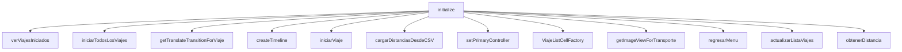

```mermaid
graph TB
    initialize[initialize]
    verViajesIniciados[verViajesIniciados]
    iniciarTodosLosViajes[iniciarTodosLosViajes]
    getTranslateTransitionForViaje[getTranslateTransitionForViaje]
    createTimeline[createTimeline]
    iniciarViaje[iniciarViaje]
    cargarDistanciasDesdeCSV[cargarDistanciasDesdeCSV]
    setPrimaryController[setPrimaryController]
    ViajeListCellFactory[ViajeListCellFactory]
    getImageViewForTransporte[getImageViewForTransporte]
    regresarMenu[regresarMenu]
    actualizarListaViajes[actualizarListaViajes]
    obtenerDistancia[obtenerDistancia]
    initialize --> verViajesIniciados
    initialize --> iniciarTodosLosViajes
    initialize --> getTranslateTransitionForViaje
    initialize --> createTimeline
    initialize --> iniciarViaje
    initialize --> cargarDistanciasDesdeCSV
    initialize --> setPrimaryController
    initialize --> ViajeListCellFactory
    initialize --> getImageViewForTransporte
    initialize --> regresarMenu
    initialize --> actualizarListaViajes
    initialize --> obtenerDistancia
```
